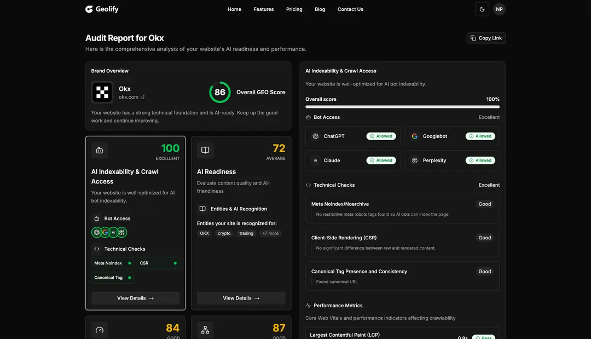

# The GEO Optimization Checklist: Citation Tracking & Authority Building



# The GEO Optimization Checklist: Citation Tracking & Authority Building (Enhanced)

**Slug:** `geo-optimization-checklist-citation-tracking`\n**Category:** Optimization Tactics\n**Target Audience:** Marketing managers, implementers\n**Intent:** Tactical / Actionable


---

## The GEO Optimization Checklist: Citation Tracking & Authority Building

GEO isn't magic. It's a systematic process of making your brand visible, trustworthy, and citable to AI engines. Unlike SEO (which has clear technical checklists), GEO is a mix of Technical + Brand Management + Digital PR.

This checklist cuts through the noise. It covers the three phases you need to build real authority and track citations across AI search engines.


---

## Phase 1: Citation Tracking (Know Your Current State)

Before you optimize, you need to know where you stand. In the GEO world, a "citation" (mention + potential link) is more valuable than a random backlink.

### Step 1: The Manual Spot-Check

- [ ] **Identify Top 20 Queries** your prospects ask
  * Example: "Best project management software," "how to improve SOV," "GEO vs SEO"
  * Mix informational + comparative intent only (transactional queries don't need GEO audit)
- [ ] **Run Each Query in 4 AI Engines**
  * ChatGPT (web search enabled)
  * Perplexity
  * Google AI Overviews ([search.google.com](http://search.google.com))
  * Claude (web search beta)
- [ ] **Log the Data for Each Query:**
  * Is your brand mentioned in the answer?
  * Where do you appear in the answer? (First source, middle, last, not mentioned)
  * **Sentiment:** How is your brand framed? (Positive "Best for...", Neutral "Also offers...", Negative "Lacks...", Not mentioned)
  * **Which sources are cited?** (Note the domains. These are your competitors in AI search)

**Time required:** 2-3 hours for 20 queries across 4 engines\n**Spreadsheet template needed:**

```
Query | ChatGPT (Yes/No/Sentiment) | Perplexity | Google AI | Claude | Top Competitor Cited
```


---

### Step 2: Source Authority Mapping

Now reverse the question: Where IS your brand getting mentioned?

- [ ] **Find AI-Trusted Sources in Your Niche**
  * Run: "best \[your category\] tools" in Perplexity
  * Document every domain cited (these are your "citation authorities")
  * Are these Tier 1 (Forbes, TechCrunch), Tier 2 (industry blogs), or Tier 3 (random)?
- [ ] **Gap Analysis: Where You Should Be Cited**
  * List top 10 citation authorities
  * For each, check: "Do they mention our brand?"
  * If NOT: That's your priority gap. You need to get into these sources.

**Why this matters:** If AI engines trust Domain A for "best CRM" articles, and Domain A doesn't mention you, then the AI learns you're irrelevant to this category—even if you rank #1 on Google.


---

### Step 3: Competitive Citation Landscape

- [ ] **Map Your Top 3 Competitors' Citation Profile**
  * Where are they getting mentioned?
  * What sources cite them that don't cite you?
  * How is their sentiment vs. yours? (Better/worse reviews, language used)
- [ ] **Find Your Unique Positioning Gaps**
  * "Competitor X gets cited on speed. We get cited on price. Neither of us gets cited on innovation."
  * This tells you what narrative to build next

**Tools used:**

* Geolify Citation Analysis (automated)
* Manual Google searches: "\[Competitor\] vs \[us\]"
* Mentions search: Mentionlytics, Mediatoolkit, or simple Google Alerts


---

## Phase 2: Authority Building (Establish Trust)

Now that you know where you stand, it's time to build the signals that tell AI engines: "This brand is authoritative."

### Step 4: Entity Consistency (The Foundation)

AI engines build a "knowledge profile" of your brand. Contradictions erode trust.

- [ ] **NAP Consistency Across All Platforms**
  * Name, Address, Phone identical on: Website + Google Business Profile + LinkedIn + Crunchbase + Wikidata
  * **One character difference = inconsistency to the AI**
  * Check using: Whitespark Local Citation Checker (free tier)
- [ ] **Business Description Consistency**
  * Your tagline/description should be identical (or extremely similar) everywhere
  * Example: Google Business Profile says "Best project management for remote teams" → LinkedIn says "Project management for distributed workforces" = Inconsistency
  * Fix: Standardize to one version, use it everywhere
- [ ] **Founder/Leadership Information**
  * List your founder(s) and leadership team on your About page
  * Include credentials, past roles, experience
  * AI weights **E-E-A-T** (Experience, Expertise, Authoritativeness, Trustworthiness)
  * Specific > generic ("CEO with 20 years in SaaS" > "CEO and founder")

**Action items:**

* Audit your website, LinkedIn, Google Business, G2, Crunchbase
* Fix all inconsistencies
* Document the "canonical" version of your brand description
* Use it everywhere going forward


---

### Step 5: Wikipedia & Wikidata (The Authority Shortcut)

Wikipedia and Wikidata are the "source of truth" for Google's Knowledge Graph and most LLMs. If you can qualify, this is **the highest-ROI move for entity authority.**

- [ ] **Check if You Qualify for Wikipedia**
  * Wikipedia requires "notability" (significant news coverage, awards, industry recognition)
  * Most B2B SaaS brands don't qualify yet. But some do.
  * Research: "\[Your company\] Wikipedia"
  * If you find one: Update it with verified sources. Don't edit it yourself (violates COI rules).
- [ ] **Create/Optimize Wikidata Entry** (Lower barrier than Wikipedia)
  * Wikidata is Wikipedia's database. Most brands can create entries.
  * Go to: [wikidata.org](http://wikidata.org)
  * Search for your company
  * If not found: Create entry (takes 10 minutes)
  * If found: Update fields (headquarters, founder, description, official website)
  * **This alone can improve your Knowledge Graph presence by 30%**
- [ ] **Optimize Your Google Knowledge Panel**
  * Claim your Knowledge Panel: [google.com/business/how-to-manage](http://google.com/business/how-to-manage)
  * Ensure all info is correct (description, founder, website)
  * Add high-quality images, videos
  * This directly influences how AI engines understand your brand

**Cost:** Free (2-4 hours of work)\n**ROI:** High (Knowledge Graph presence influences LLM citations)


---

### Step 6: Co-Citation Strategy (Association Building)

AI learns by association. Get mentioned alongside authority brands.

- [ ] **Identify 5-10 Industry Leaders**
  * Who are the "Trusted Voices" in your category?
  * Example: For GEO tools, that's Semrush, Ahrefs, SEMrush
  * Example: For CRM, that's Salesforce, HubSpot, Pipedrive
- [ ] **Create "Mentioned Alongside" Content**
  * Write articles that naturally mention you + leaders in same breath
  * Example: "Unlike Salesforce \[which lacks X\], we provide \[Y\]"
  * Example: "Compared to HubSpot, our solution offers..."
  * **Goal:** Train the AI: "When thinking about CRM, include \[our brand\]"
- [ ] **Publish Original Data (The Citation Magnet)**
  * Release research reports, industry benchmarks, or whitepapers with original data
  * AI engines prioritize citing **primary sources** over secondary commentary
  * Example: "2025 GEO Report: 73% of agencies still haven't audited AI visibility"
  * Pitch this to media: "Original data = high-likelihood they cite it"
  * When TechCrunch cites your study, the AI learns: "This brand produces trusted research"

**Action items:**

* Publish 1 research report per quarter
* Pitch to Tier 1 media (Forbes, TechCrunch, HubSpot Blog, etc.)
* Get mentions in competitor comparison articles (ask for link/mention)
* Ensure original data is unique and defensible


---

## Phase 3: Technical GEO (Make Content LLM-Friendly)

Finally, make it easy for AI to read, parse, and cite your content.

### Step 7: Implement `/llms.txt`

`llms.txt` is the new `robots.txt`. It tells AI crawlers what to read.

- [ ] **Create** `**/llms.txt**` **file** on your root domain
  * Path: [yoursite.com/llms.txt](http://yoursite.com/llms.txt)
  * Contents: Summarized, clean version of your core content
  * Purpose: Make it super easy for Claude, ChatGPT crawlers to understand you
- [ ] **Template (10-20 lines):**

  ```
  # [Your Company] - Brand Summary
  
  [Company Name] is [one-line value prop].
  
  **Core Services:**
  - Service 1: [Description]
  - Service 2: [Description]
  
  **Key Statistics:**
  - [Metric] ([Year])
  - [Metric] ([Year])
  
  **Founder(s):** [Names + credentials]
  
  **Contact:** [Email/URL]
  
  **Learning Resources:**
  - Blog: yoursite.com/blog
  - Research: yoursite.com/research
  ```
- [ ] **Validate on:** ai.com/tools/llms-txt-checker (experimental)

**Time required:** 30 minutes\n**ROI:** High (makes AI crawlers' job easier = more citations)


---

### Step 8: Content Chunking for LLM Context Windows

LLMs have limited "context windows." They scan top \~2,000 tokens of a page to understand it. Make your content count.

- [ ] **For Blog Articles:**
  * **First 100 words:** Answer the question directly (no preamble)
  * **Paragraphs:** Max 3-4 sentences. Short = better for LLM parsing
  * **Headings:** Clear, question-based (H2 every 250 words max)
  * **Bullets:** Use for steps, features, comparisons (not narrative)
- [ ] **For Comparison Content:**
  * Use tables (vs. prose). LLMs extract table data easily.
  * Include row labels clearly
  * Example: "vs." tables beat narrative comparison every time
- [ ] **For Data Posts:**
  * Lead with the finding in bold
  * Then provide context/explanation
  * Example: **"60% of searches end without a click."** Here's why that matters...

**Test:** Paste your article into ChatGPT. Ask "Can you summarize this in 2 sentences?" If the AI gets it right, you're LLM-friendly.


---

### Step 9: Advanced Schema Markup

Schema tells AI engines what type of content this is.

- [ ] **Implement FAQPage Schema** (Highest ROI)
  * This is the single best schema for GEO
  * Structure: Q&A format with clear questions/answers
  * Recommendation: Use JSON-LD format

  ```json
  {
    "@context": "schema.org",
    "@type": "FAQPage",
    "mainEntity": [{
      "@type": "Question",
      "name": "What is GEO?",
      "acceptedAnswer": {
        "@type": "Answer",
        "text": "[Short answer: 40-60 words]"
      }
    }]
  }
  ```
  * **Impact:** 40% higher citation rate on Perplexity \[Geolify Internal Research, 2025\]
- [ ] **Implement Organization Schema**
  * Clarify: Company name, logo, location, contact, description
  * Tie together your "identity" across web
- [ ] **Implement Person Schema (For Founders)**
  * Founder profiles with education, credentials, past roles
  * Links founder to company via "worksFor"
- [ ] **Validate:** Use Google's Rich Results Test
  * [paste.google.com/structured-data-testing-tool/](http://paste.google.com/structured-data-testing-tool/)
  * Ensure no errors

**Tools:** [schema.org](http://schema.org), JSON-LD generator sites, Yoast SEO plugin (auto-generates)


---

### Step 10: Citation Authority Checklist

- [ ] Track your citations in a spreadsheet:
  * Date cited
  * Platform (ChatGPT, Perplexity, Google AI)
  * Query
  * Sentiment
  * Source domain citing you
  * Traffic/conversion from that citation (if trackable)
- [ ] Monthly review:
  * Where are new citations coming from?
  * Which platforms mention you most?
  * What's your trend? (Up/down/stable)
- [ ] Use Geolify (or similar) for automated tracking:
  * Saves 5+ hours/month of manual work
  * Alerts you to new mentions
  * Tracks sentiment shifts


---

## The Bottom Line

GEO isn't one-and-done. It's a continuous process:


1. **Audit** → Where are you now?
2. **Build Authority** → Entity consistency, Wikipedia, co-citations, original data
3. **Make Content LLM-Friendly** → Schema, /llms.txt, chunking, structure
4. **Measure** → Track citations, sentiment, visibility over time

Start with Phase 1 (Audit). Spend a weekend on it. You'll find gaps that cost you thousands in lost visibility.

Then move to Phase 2 (Authority). This is where real competitive advantage happens.

Finally, Phase 3 (Technical) supports everything. Get the basics right.

If you do this correctly, the AI engines will start recommending you. Not because you paid for it. Because your brand is genuinely the most trustworthy source in your category.

That's the GEO win.